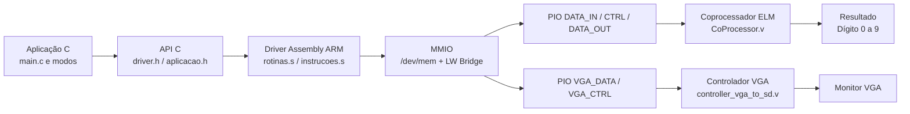
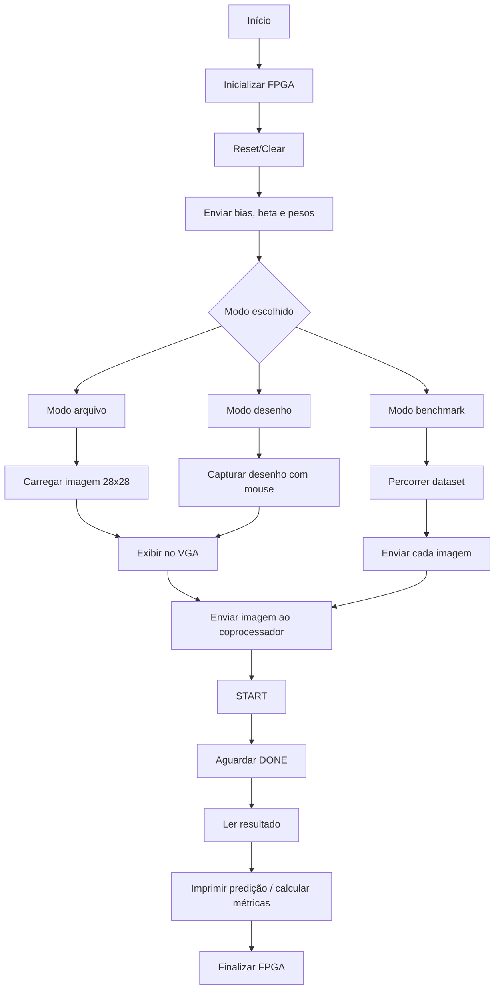
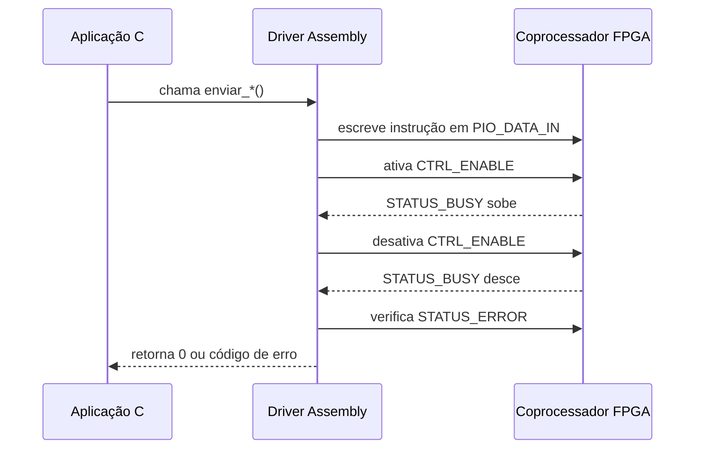

# Marco 3

Universidade Estadual de Feira de Santana

MI - Sistemas Digitais

Adna Amorim, Allen Junior

Sistema final de inferência de dígitos numéricos usando uma rede neural ELM (*Extreme Learning Machine*) acelerada em FPGA, com driver Linux em Assembly ARM e aplicação em C para execução em três modos pelo menu interativo: imagem por arquivo, desenho com mouse na tela VGA e benchmark com métricas.

Este repositório corresponde ao **Marco 3** da disciplina **MI — Sistemas Digitais (TEC 499 — UEFS 2026.1)**. O objetivo deste marco é entregar a solução completa, integrando o coprocessador ELM implementado em Verilog, o driver em Assembly ARM via MMIO e uma aplicação em C capaz de operar o sistema de forma utilizável e mensurável.

A comunicação entre o HPS e a FPGA é feita por **Memory-Mapped I/O (MMIO)** usando a **Lightweight HPS-to-FPGA Bridge**. A aplicação em C inicializa o hardware, carrega os parâmetros da rede, envia imagens ao coprocessador, exibe imagens no VGA, recebe o dígito previsto, calcula métricas de validação e registra o uso em arquivos CSV de histórico.

- <strong>Aplicação C com menu interativo:</strong> implementar uma aplicação final com execução por menu, permitindo inferência individual, desenho e validação por dataset. Nesta versão do código, o `main.c` usa `int main(void)` e não trata argumentos de linha de comando.
- <strong>Integração com IP-Core VGA:</strong> exibir a imagem enviada ao coprocessador e permitir desenho manual de um dígito usando mouse.
- <strong>Comunicação HPS-FPGA:</strong> reutilizar o driver Assembly ARM desenvolvido no Marco 2 para controlar o coprocessador via MMIO.
- <strong>Validação e Benchmark:</strong> executar N imagens do dataset, comparar predição com rótulo esperado, calcular acurácia, latência média, desvio padrão e throughput.
- <strong>Registro dos Resultados:</strong> salvar o histórico de uso em `historico_usuario.csv` e o histórico das inferências em `historico_inferencias.csv`, incluindo data/hora, modo, caminho da imagem, predição, resultado, latência e status.

## Sumário

| Tópico | O que você encontra |
|---|---|
| [Levantamento de Requisitos](#levantamento-de-requisitos) | Entradas, saídas, modos de operação e requisitos do Marco 3. |
| [Softwares e Versões](#softwares-e-versoes) | Ferramentas usadas no desenvolvimento, síntese e execução. |
| [Hardwares Usados](#hardwares-usados) | Placa, FPGA, HPS, VGA, mouse e periféricos necessários. |
| [Instalação e Configuração do Ambiente](#instalacao-e-configuracao-do-ambiente) | Passo a passo para preparar, compilar e executar o projeto. |
| [Arquitetura Final](#arquitetura-final-hardware-e-software) | Integração entre aplicação C, driver Assembly, MMIO, coprocessador e VGA. |
| [Mapa MMIO e Registradores](#mapa-mmio-e-registradores) | Offsets, bits de controle, status e escrita no VGA. |
| [Aplicação C](#aplicacao-c) | Organização dos arquivos, fluxo de inicialização e funções principais. |
| [Modos de Operação](#modos-de-operacao) | Modo arquivo, modo desenho e modo benchmark. |
| [Driver Assembly](#driver-assembly-arm) | Funções exportadas, handshake e códigos de erro. |
| [Build e Execução](#build-e-execucao) | Makefile, comandos de compilação e exemplos de uso. |
| [Testes de Funcionamento](#testes-de-funcionamento) | Procedimentos de validação e saídas esperadas. |
| [Resultados e Métricas](#resultados-e-metricas) | Acurácia, latência, desvio padrão, throughput e históricos CSV. |
| [Análise dos Resultados](#analise-dos-resultados) | Discussão dos gargalos, melhorias tentadas e limitações. |

<details id="levantamento-de-requisitos">
<summary><strong>Levantamento de Requisitos</strong></summary>

## Levantamento de Requisitos

### Objetivo do Marco 3

O Marco 3 tem como objetivo entregar o sistema final utilizável. A solução deve permitir que o usuário escolha uma imagem, desenhe um dígito na tela ou execute uma validação com várias imagens. Em todos os casos, a inferência é feita no coprocessador ELM implementado na FPGA.

### Requisitos atendidos pela aplicação

| Requisito | Implementação no projeto |
|---|---|
| Aplicação em C | Implementada em `src/main.c`, `src/util.c`, `src/modo_arquivo.c`, `src/modo_desenho.c` e `src/modo_benchmark.c` |
| Execução por menu | `sudo ./aplicacao` abre o menu principal com as opções Arquivo, Desenho, Benchmark e Sair |
| Modo arquivo | Opção `1` do menu; o usuário digita o caminho de uma imagem `.png` ou `.bin` |
| Modo desenho | Opção `2` do menu; o usuário desenha com o mouse conectado em `/dev/input/mice` |
| Modo benchmark | Opção `3` do menu; o usuário informa o diretório do dataset e a quantidade de imagens |
| Exibição via VGA | Escrita no PIO `vga_data`, offset `+0x30` da bridge |
| Envio da imagem ao coprocessador | Função `carregar_e_inferir(modo, origem_imagem, pixels, digito_out)` chama `enviar_imagem()`, `inferencia()` e `ler_resultado()` |
| Benchmark com métricas | Cálculo de acurácia, latência média, desvio padrão e throughput |
| Histórico de uso | Arquivo `historico_usuario.csv` registra ações do menu, erros e encerramento do programa |
| Histórico de inferências | Arquivo `historico_inferencias.csv` registra as inferências com data/hora, modo, imagem, predição, resultado, latência e status |

### Entradas do sistema

A aplicação trabalha com imagens de dígitos no formato **28×28 pixels**, em escala de cinza, com **8 bits por pixel**. O projeto aceita dois formatos de entrada:

| Tipo | Extensão | Como é carregado | Observação |
|---|---|---|---|
| Imagem PNG | `.png` | `png_carregar()` usando `stb_image.h` | Precisa ter 28×28 pixels |
| Imagem binária | `.bin` | `png_carregar_bin()` | Precisa ter exatamente 784 bytes |
| Desenho manual | matriz 28×28 em memória | gerado pelo modo desenho | Pode ser salvo como `desenho.png` |

Além da imagem, a rede utiliza os parâmetros pré-treinados da ELM:

| Dado | Arquivo | Formato | Tamanho |
|---|---|---|---|
| Pesos da camada oculta | `data/W_in_q.bin` | Q4.12, 4 bytes por valor | 401.408 bytes |
| Bias da camada oculta | `data/b_q.bin` | Q4.12, 4 bytes por valor | 512 bytes |
| Pesos da camada de saída | `data/beta_q.bin` | Q4.12, 4 bytes por valor | 5.120 bytes |

Esses parâmetros são enviados uma única vez no início da execução, antes da escolha dos modos, reduzindo o custo de transferência durante as inferências.

### Dataset usado no benchmark

O diretório `data/imagens/` está organizado por subpastas de rótulo, indo de `0` até `9`. O nome da subpasta é usado como o valor esperado para comparação com a predição do coprocessador

### Saídas do sistema

A saída principal é o dígito classificado, um número inteiro entre `0` e `9`. Além disso, a aplicação gera arquivos CSV de histórico para registrar o uso e as inferências.

| Saída | Descrição |
|---|---|
| Dígito previsto | Valor retornado por `ler_resultado()` a partir dos bits `[3:0]` de `PIO_DATA_OUT` |
| Acurácia | Percentual de imagens classificadas corretamente no benchmark |
| Latência média | Tempo médio de inferência por imagem válida, em milissegundos |
| Desvio padrão | Variação da latência entre as imagens processadas com sucesso |
| Throughput | Quantidade de imagens válidas processadas por segundo |
| `historico_usuario.csv` | Histórico das ações do usuário no menu, inicialização, erros e encerramento |
| `historico_inferencias.csv` | Histórico das inferências realizadas nos modos Arquivo, Desenho e Benchmark |

[Voltar ao sumário](#sumario)

</details>

<details id="softwares-e-versoes">
<summary><strong>Softwares e Versões</strong></summary>

## Softwares e Versões

| Software | Uso no projeto | Versão/observação |
|---|---|---|
| Linux embarcado no HPS | Execução da aplicação e acesso a `/dev/mem` | Ambiente Linux da DE1-SoC |
| GCC ARM | Compilação da aplicação C com rotinas Assembly | Usado diretamente na placa |
| GNU Make | Automação do build | Alvo principal: `aplicacao` |
| Quartus Prime Lite | Síntese, Platform Designer e geração do `.sof` | Projeto registra `25.1std.0 Lite Edition` em `soc_system.qsf` |
| Platform Designer/Qsys | Integração HPS, PIOs, bridge e IPs | Arquivo `coprocessador/soc_system.qsys` |
| Biblioteca `stb_image.h` | Leitura de PNG em escala de cinza | Incluída em `api/stb_image.h` |
| Biblioteca `stb_image_write.h` | Salvamento do desenho como PNG | Incluída em `api/stb_image_write.h` |

### Bibliotecas usadas na compilação

A biblioteca `-lm` é usada para cálculos matemáticos, como `sqrt()` no desvio padrão. A biblioteca `-lrt` é usada por causa de `clock_gettime()`, empregado na medição da latência.

[Voltar ao sumário](#sumario)

</details>

<details id="hardwares-usados">
<summary><strong>Hardwares Usados</strong></summary>

## Hardwares Usados

| Hardware | Função |
|---|---|
| DE1-SoC | Plataforma principal do projeto |
| FPGA Cyclone V `5CSEMA5F31C6` | Implementação do coprocessador ELM e do controlador VGA |
| HPS ARM Cortex-A9 | Execução do Linux, aplicação C e driver Assembly |
| Lightweight HPS-to-FPGA Bridge | Comunicação MMIO entre HPS e FPGA |
| Monitor VGA | Exibição da imagem carregada ou desenhada |
| Mouse USB | Entrada do modo desenho através de `/dev/input/mice` |
| Cabo USB-Blaster/JTAG | Gravação do bitstream `.sof` na FPGA |
| Terminal SSH ou serial | Acesso ao Linux embarcado na placa |

[Voltar ao sumário](#sumario)

</details>

<details id="instalacao-e-configuracao-do-ambiente">
<summary><strong>Instalação e Configuração do Ambiente</strong></summary>

## Instalação e Configuração do Ambiente

### Pré-requisitos

- Placa DE1-SoC ligada e acessível por terminal serial ou SSH.
- Bitstream `.sof` do projeto compilado no Quartus e gravado na FPGA.
- Bridge Lightweight HPS-to-FPGA habilitada no sistema Linux.
- Mouse USB conectado à placa para o modo desenho.
- Monitor conectado na saída VGA da DE1-SoC.
- Diretório `data/` contendo `W_in_q.bin`, `b_q.bin`, `beta_q.bin` e as imagens de teste.

### Passo 1 — Gravar o hardware na FPGA

Abra o projeto `coprocessador/soc_system.qpf` no Quartus Prime Lite, compile o projeto e grave o arquivo `.sof` gerado na placa usando **Tools → Programmer**.

O top-level do projeto é:

```text
coprocessador/ghrd_top.v
```

Esse top-level instancia o sistema HPS, o coprocessador ELM e o controlador VGA.

### Passo 2 — Conferir a organização dos arquivos

A aplicação espera que os arquivos principais estejam organizados desta forma:

```text
.
├── Apresentação.pdf
├── Makefile
├── api/
│   ├── aplicacao.h
│   ├── driver.h
│   ├── stb_image.h
│   └── stb_image_write.h
├── src/
│   ├── main.c
│   ├── util.c
│   ├── modo_arquivo.c
│   ├── modo_desenho.c
│   └── modo_benchmark.c
├── driver/
│   ├── rotinas.s
│   └── instrucoes.s
├── coprocessador/
│   ├── ghrd_top.v
│   ├── CoProcessor.v
│   ├── controller_vga_to_sd.v
│   ├── vga_driver.v
│   └── demais módulos Verilog
└── data/
    ├── W_in_q.bin
    ├── b_q.bin
    ├── beta_q.bin
    └── imagens/
        ├── 0/
        ├── 1/
        ├── ...
        └── 9/
```

### Passo 3 — Compilar a aplicação

No terminal da placa, entre no diretório do projeto e execute:

```bash
make
```

O binário gerado será:

```text
aplicacao
```

### Passo 4 — Executar com permissão de acesso ao hardware

Como o driver acessa `/dev/mem`, a execução deve ser feita como `root` ou com permissão equivalente:

```bash
sudo ./aplicacao
```

Nesta versão, os modos específicos são acessados pelo menu interativo; o `main.c` atual não processa argumentos de linha de comando.

[Voltar ao sumário](#sumario)

</details>

<details id="arquitetura-final-hardware-e-software">
<summary><strong>Arquitetura Final</strong></summary>

## Arquitetura Final — Hardware e Software

A arquitetura final é composta por cinco blocos principais:

1. Aplicação em C.
2. Driver em Assembly ARM.
3. Interface MMIO pela Lightweight HPS-to-FPGA Bridge.
4. Coprocessador ELM em Verilog.
5. Controlador VGA em Verilog.



### Fluxo geral da aplicação



### Hardware

| `controller_vga_to_sd.v` | Recebe pixels do HPS e escreve na memória de vídeo |
| `vga_driver.v` | Gera sincronismo e sinais RGB para o monitor VGA |

### Software

| Arquivo | Responsabilidade |
|---|---|
| `src/main.c` | Menu interativo, validação de entradas, registro em `historico_usuario.csv`, inicialização e finalização da FPGA |
| `src/util.c` | Carregamento de PNG/BIN, chamada de inferência, cálculo de latência, registro em `historico_inferencias.csv` e limpeza da tela VGA |
| `src/modo_arquivo.c` | Carrega uma imagem, exibe no VGA e imprime o dígito previsto |
| `src/modo_desenho.c` | Captura o mouse, desenha em grade 28×28 e executa inferência com Enter |
| `src/modo_benchmark.c` | Percorre o dataset, calcula métricas e usa `registrar_log_csv()` para registrar inferências do benchmark |

[Voltar ao sumário](#sumario)

</details>

<details id="mapa-mmio-e-registradores">
<summary><strong>Mapa MMIO e Registradores</strong></summary>

## Mapa MMIO e Registradores

A comunicação ocorre a partir da base física da Lightweight HPS-to-FPGA Bridge:

```text
LW_BRIDGE_BASE = 0xFF200000
```

O driver mapeia uma janela de 20 KB:

```text
BRIDGE_TAMANHO = 0x00005000
```

### Offsets usados

| Registrador | Offset | Direção | Função |
|---|---:|---|---|
| `PIO_DATA_IN` | `+0x00` | HPS → FPGA | Palavra de instrução de 32 bits enviada ao coprocessador |
| `PIO_DATA_OUT` | `+0x10` | FPGA → HPS | Status da inferência e dígito previsto |
| `PIO_CTRL` | `+0x20` | HPS → FPGA | Bits de `ENABLE`, `CLEAR` e `RESET` |
| `VGA_DATA` | `+0x30` | HPS → FPGA | Pacote de escrita de pixel no VGA |
| `VGA_CTRL` | `+0x40` | FPGA → HPS | Sinalização do controlador VGA |

### `PIO_CTRL`

| Bit | Máscara | Nome | Função |
|---:|---:|---|---|
| 0 | `0x1` | `CTRL_ENABLE` | Indica que há uma instrução válida em `PIO_DATA_IN` |
| 1 | `0x2` | `CTRL_CLEAR` | Limpa flags de `DONE` e `ERROR` |
| 2 | `0x4` | `CTRL_RESET` | Reinicia a lógica interna do coprocessador |

### `PIO_DATA_OUT`

O coprocessador gera a palavra de saída no formato:

```text
{ 25'b0, fl_error, fl_processor_busy, fl_processor_done, predicted_digit[3:0] }
```

| Bits | Nome | Descrição |
|---|---|---|
| `[3:0]` | `RESULT` | Dígito previsto entre 0 e 9 |
| `[4]` | `STATUS_DONE` | Inferência concluída |
| `[5]` | `STATUS_BUSY` | Coprocessador ocupado |
| `[6]` | `STATUS_ERROR` | Erro de opcode, endereço ou operação inválida |

### Palavra de escrita no VGA

A aplicação escreve pixels no VGA através do registrador `VGA_DATA`, no offset `+0x30`:

| Bits | Campo | Descrição |
|---|---|---|
| `[8:0]` | `x` | Coordenada horizontal, de 0 a 319 |
| `[16:9]` | `y` | Coordenada vertical, de 0 a 239 |
| `[19:17]` | `red` | Intensidade do vermelho, 3 bits |
| `[22:20]` | `green` | Intensidade do verde, 3 bits |
| `[25:23]` | `blue` | Intensidade do azul, 3 bits |
| `[26]` | `enable` | Pulso de escrita do pixel |

O controlador trabalha internamente com uma área de 320×240 pixels. O módulo VGA gera a saída para o monitor, duplicando a escala de leitura para preencher a resolução VGA.

### Conjunto de instruções do coprocessador

| Opcode `[2:0]` | Mnemônica | Campos principais | Limite |
|---|---|---|---|
| `000` | `STORE_IMG` | pixel `[20:13]`, endereço `[12:3]` | 784 pixels |
| `001` | `STORE_WEIGHTS_ADDR` | endereço `[19:3]` | 100.352 pesos |
| `010` | `STORE_WEIGHTS_VALUE` | valor Q4.12 `[18:3]` | usa endereço enviado antes |
| `011` | `STORE_BIAS` | valor `[25:10]`, endereço `[9:3]` | 128 bias |
| `100` | `STORE_BETA` | valor `[29:14]`, endereço `[13:3]` | 1.280 valores beta |
| `101` | `START` | sem campos adicionais | inicia inferência |
| `110` | `STATUS` | sem campos adicionais | consulta estado |
| `111` | `NOP` | sem operação | reservado |

[Voltar ao sumário](#sumario)

</details>

<details id="aplicacao-c">
<summary><strong>Aplicação C</strong></summary>

## Aplicação C

A aplicação C foi organizada em módulos para separar o menu principal, os modos de execução, as funções utilitárias e o registro das inferências.

### Inicialização

No início da execução, `main.c` realiza as seguintes etapas:

1. Cria ou reinicia o arquivo `historico_usuario.csv` com o cabeçalho `timestamp,mensagem`.
2. Chama `inicializar_fpga()` para abrir `/dev/mem` e mapear a bridge.
3. Registra no histórico se a FPGA foi mapeada com sucesso ou se ocorreu erro.
4. Executa `reset_clean_fpga()` para limpar o estado do coprocessador.
5. Envia `bias`, `beta` e `pesos` para a FPGA.
6. Registra no histórico se os parâmetros foram carregados corretamente.
7. Entra no menu interativo.
8. Ao sair, limpa a tela VGA, chama `finalizar_fpga()` e registra o encerramento.

O envio dos parâmetros da rede ocorre apenas uma vez, pois eles não mudam entre as inferências.

### Menu principal

O `main.c` atual usa `int main(void)`, portanto a execução por argumentos de linha de comando não está ativa nesta versão. A operação é feita pelo menu:

```text
===================================
MENU
===================================
1. Modo Arquivo
2. Modo Desenho
3. Modo Benchmark
0. Sair do programa
===================================
Digite uma opcao:
```

### Função central de inferência

A função `carregar_e_inferir()` concentra o fluxo de inferência usado pelos três modos:

```c
int carregar_e_inferir(
    const char *modo,
    const char *origem_imagem,
    const uint8_t *pixels,
    int *digito_out);
```

| Etapa | Função/ação |
|---|---|
| Iniciar medição | `clock_gettime(CLOCK_MONOTONIC, &t0)` |
| Limpar estado anterior | `reset_clean_fpga()` |
| Definir ponteiro da imagem | `imagem_ptr = pixels` |
| Enviar imagem 28×28 | `enviar_imagem()` |
| Iniciar processamento | `inferencia()` |
| Ler resultado | `ler_resultado()` |
| Registrar histórico | `registrar_log_csv(modo, origem_imagem, predicao, latencia, status)` |
| Limpar estado final | `reset_clean_fpga()` em caso de sucesso |

A função também registra falhas específicas, como `ERRO_ENVIO_IMAGEM`, `ERRO_PROCESSAMENTO` e `ERRO_LEITURA`.

### Históricos CSV

| Arquivo | Gerado por | Conteúdo |
|---|---|---|
| `historico_usuario.csv` | `main.c` | Ações do menu, erros de entrada, arquivos inexistentes, inicialização e encerramento |
| `historico_inferencias.csv` | `src/util.c` | Data/hora, modo, caminho da imagem, predição, resultado, latência e status |

### Carregamento de imagens

| Função | Entrada | Validação |
|---|---|---|
| `png_carregar()` | arquivo `.png` | exige largura 28 e altura 28 |
| `png_carregar_bin()` | arquivo `.bin` | exige leitura de 784 bytes |

Para arquivos PNG, a biblioteca `stb_image.h` converte a imagem para escala de cinza (`STBI_grey`).

[Voltar ao sumário](#sumario)

</details>

<details id="modos-de-operacao">
<summary><strong>Modos de Operação</strong></summary>

## Modos de Operação

A aplicação atual funciona pelo menu interativo. Para iniciar:

```bash
sudo ./aplicacao
```

### Menu interativo

```text
===================================
MENU
===================================
1. Modo Arquivo
2. Modo Desenho
3. Modo Benchmark
0. Sair do programa
===================================
Digite uma opcao:
```

### Modo 1 — Inferência por arquivo

O modo arquivo carrega uma imagem `.png` ou `.bin`, desenha a imagem ampliada no VGA e envia o vetor de 784 pixels ao coprocessador.

Fluxo de uso:

1. Escolher a opção `1. Modo Arquivo`.
2. Digitar o caminho da imagem, por exemplo `data/imagens/4/4.png`.
3. O programa testa se o arquivo existe.
4. A imagem é carregada, exibida no VGA e enviada ao coprocessador.
5. A predição é impressa no terminal.
6. A inferência é registrada em `historico_inferencias.csv` com modo `Arquivo`.

Saída esperada:

```text
===================================
Digito previsto: 4
===================================
```

### Modo 2 — Inferência por desenho

O modo desenho permite desenhar um dígito usando o mouse conectado ao Linux da DE1-SoC. A área de desenho é uma grade lógica de 28×28 células, exibida ampliada no VGA.

Fluxo de uso:

1. Escolher a opção `2. Modo Desenho`.
2. Desenhar o dígito com o mouse.
3. Pressionar `Enter` para enviar o desenho ao coprocessador.
4. A predição é impressa no terminal.
5. A inferência é registrada em `historico_inferencias.csv` com modo `Desenho` e origem `Tela_VGA`.

Controles:

| Comando | Ação |
|---|---|
| Movimento do mouse | Move o cursor na grade 28×28 |
| Botão esquerdo | Desenha pixels brancos/cinzas |
| Botão direito | Apaga pixels próximos |
| `Enter` | Envia o desenho ao coprocessador e imprime a predição |
| `C` | Limpa a área de desenho |
| `P` | Salva o desenho atual como `desenho.png` |
| `Q` | Sai do modo desenho |

O desenho usa um kernel de suavização 3×3 para aproximar melhor a aparência das imagens MNIST, evitando que o traço fique excessivamente quadrado ou fino.

### Modo 3 — Benchmark

O modo benchmark percorre as subpastas `0` até `9` dentro do diretório informado pelo usuário, seleciona imagens de cada classe e executa inferências em lote para medir desempenho e acurácia.

Fluxo de uso:

1. Escolher a opção `3. Modo Benchmark`.
2. Digitar o caminho das imagens, por exemplo `data/imagens`.
3. O programa verifica se o diretório existe.
4. Digitar a quantidade de imagens desejada.
5. O programa valida se a quantidade é maior que zero.
6. O benchmark percorre as subpastas `0` a `9`, buscando imagens `.png` e `.bin`.
7. Calcula `limite_por_subpasta = N / 10`; se o resultado for menor que `1`, usa `1` imagem por subpasta.
8. Embaralha os arquivos encontrados dentro de cada subpasta.
9. Seleciona até `limite_por_subpasta` imagens por dígito.
10. Para cada imagem, carrega o arquivo, executa `carregar_e_inferir("Benchmark", caminho, pixels, &digito_predito)` e compara o resultado com o rótulo esperado.
11. Mostra no terminal o progresso de cada inferência válida.
12. Ao final, imprime as métricas do benchmark.

Saída esperada no terminal:

```text
[1/1000]    subpasta=0    arquivo=10.png    predito=0    OK    (X.XX ms)
...
===================================
RESULTADOS DO BENCHMARK
===================================
Total de imagens: 1000
Acertos         : XXX
Acuracia        : XX.XX%
Latencia media  : X.XXX ms
Desvio padrao   : X.XXX ms
Throughput      : XX.XX imagens/s
===================================
```

Possíveis status registrados no histórico de inferências:

| Status | Significado |
|---|---|
| `SUCESSO` | A imagem foi enviada, processada e o resultado foi lido corretamente |
| `ERRO_CARGA_ARQUIVO` | A imagem não pôde ser carregada do disco |
| `ERRO_ENVIO_IMAGEM` | Houve falha ao enviar os pixels ao coprocessador |
| `ERRO_PROCESSAMENTO` | A inferência falhou durante o processamento |
| `ERRO_LEITURA` | O resultado não pôde ser lido corretamente |

[Voltar ao sumário](#sumario)

</details>

<details id="driver-assembly-arm">
<summary><strong>Driver Assembly ARM</strong></summary>

## Driver Assembly ARM

O driver em Assembly ARM foi mantido como camada de baixo nível responsável pela comunicação direta com o hardware. A aplicação C não escreve diretamente nos registradores do coprocessador ELM; ela chama as funções exportadas pelo driver.

### Arquivos do driver

| Arquivo | Função |
|---|---|
| `driver/rotinas.s` | Inicialização, mapeamento de memória, reset, clear e finalização |
| `driver/instrucoes.s` | Envio das instruções, parâmetros, imagem, start e leitura do resultado |
| `api/driver.h` | Interface pública usada pela aplicação C |

### Funções exportadas

| Função | Implementação | Descrição |
|---|---|---|
| `inicializar_fpga()` | `rotinas.s` | Abre `/dev/mem` e mapeia a Lightweight Bridge |
| `finalizar_fpga()` | `rotinas.s` | Desfaz `mmap`, fecha `/dev/mem` e zera ponteiros globais |
| `reset_clean_fpga()` | `rotinas.s` | Pulsa `RESET` e `CLEAR` no `PIO_CTRL` |
| `enviar_bias()` | `instrucoes.s` | Envia 128 valores de bias |
| `enviar_beta()` | `instrucoes.s` | Envia 1.280 valores beta |
| `enviar_pesos()` | `instrucoes.s` | Envia 100.352 pesos, usando endereço e valor |
| `enviar_imagem()` | `instrucoes.s` | Envia 784 pixels da imagem atual |
| `inferencia()` | `instrucoes.s` | Envia `START` e aguarda `DONE` |
| `ler_resultado()` | `instrucoes.s` | Lê os bits `[3:0]` de `PIO_DATA_OUT` |

### Handshake MMIO

O envio de uma instrução segue o protocolo:



### Códigos de erro

| Código | Origem | Causa provável |
|---:|---|---|
| `0` | qualquer função | Sucesso |
| `-2` | `inferencia()` | Timeout aguardando `STATUS_DONE` |
| `-3` | envio ou inferência | `STATUS_ERROR` ativo no hardware |
| `-99` | handshake interno | `BUSY` não subiu ou não desceu dentro do limite |

[Voltar ao sumário](#sumario)

</details>

<details id="build-e-execucao">
<summary><strong>Build e Execução</strong></summary>

## Build e Execução

### Compilar

```bash
make
```

### Limpar binário

```bash
make clean
```

### Executar a aplicação

```bash
sudo ./aplicacao
```

A versão atual abre o menu interativo. O `main.c` está declarado como `int main(void)`, portanto os comandos por argumento, como `./aplicacao -a`, `./aplicacao -b` e `./aplicacao -d`, não estão ativos nesta versão do código.

### Observações importantes

- A execução precisa de permissão para acessar `/dev/mem`.
- O modo desenho depende de `/dev/input/mice`.
- O monitor VGA deve estar conectado antes da execução dos modos que desenham na tela.
- O arquivo `historico_usuario.csv` é reiniciado a cada execução do programa.
- O arquivo `historico_inferencias.csv` registra as inferências realizadas pela função `carregar_e_inferir()`.
- O parâmetro `csv_saida` de `modo_benchmark()` existe no protótipo, mas é ignorado nesta versão do código.
- Os arquivos `W_in_q.bin`, `b_q.bin` e `beta_q.bin` precisam estar dentro de `data/`.

[Voltar ao sumário](#sumario)

</details>

<details id="testes-de-funcionamento">
<summary><strong>Testes de Funcionamento</strong></summary>

## Testes de Funcionamento

### Teste 1 — Compilação

Comando:

```bash
make clean
make
```

Critério de sucesso:

| Verificação | Resultado esperado |
|---|---|
| Geração do binário | arquivo `aplicacao` criado |
| Linkedição C + Assembly | sem erro de referência indefinida |
| Uso de `clock_gettime()` | linkagem correta com `-lrt` |
| Uso de `sqrt()` | linkagem correta com `-lm` |

### Teste 2 — Inicialização da FPGA e histórico do usuário

Comando:

```bash
sudo ./aplicacao
```

Critério de sucesso:

| Etapa | Resultado esperado |
|---|---|
| Criar histórico | arquivo `historico_usuario.csv` criado com cabeçalho `timestamp,mensagem` |
| Abrir `/dev/mem` | sucesso |
| Mapear bridge | ponteiro virtual não nulo |
| Reset/Clear | flags limpas |
| Enviar bias, beta e pesos | retorno `0` |
| Exibir menu | menu aparece no terminal |
| Registrar eventos | `historico_usuario.csv` registra inicialização e carregamento dos parâmetros |

### Teste 3 — Inferência individual por arquivo

Procedimento:

1. Executar `sudo ./aplicacao`.
2. Escolher a opção `1. Modo Arquivo`.
3. Digitar um caminho válido, por exemplo `data/imagens/4/4.png`.

Critério de sucesso:

| Etapa | Resultado esperado |
|---|---|
| Verificação do arquivo | o programa confirma que o arquivo existe |
| Carregar PNG/BIN | imagem 28×28 carregada |
| Exibir no VGA | imagem aparece centralizada na tela |
| Enviar imagem | `enviar_imagem()` retorna `0` |
| Processar | `inferencia()` retorna `0` |
| Ler resultado | valor entre `0` e `9` |
| Histórico | `historico_inferencias.csv` registra uma linha com modo `Arquivo` |

### Teste 4 — Modo desenho

Procedimento:

1. Executar `sudo ./aplicacao`.
2. Escolher a opção `2. Modo Desenho`.

Critério de sucesso:

| Ação | Resultado esperado |
|---|---|
| Mover mouse | cursor vermelho muda de posição |
| Clicar com botão esquerdo | célula é desenhada |
| Pressionar `Enter` | desenho é enviado ao coprocessador |
| Pressionar `P` | arquivo `desenho.png` é salvo |
| Pressionar `Q` | modo desenho é encerrado |
| Histórico | inferências feitas com `Enter` aparecem em `historico_inferencias.csv` com modo `Desenho` |

### Teste 5 — Benchmark

Procedimento:

1. Executar `sudo ./aplicacao`.
2. Escolher a opção `3. Modo Benchmark`.
3. Digitar o diretório do dataset, por exemplo `data/imagens`.
4. Digitar a quantidade de imagens, por exemplo `1000`.

Critério de sucesso:

| Verificação | Resultado esperado |
|---|---|
| Validação do diretório | erro se o caminho não existir; continua se o diretório for válido |
| Validação da quantidade | erro se a quantidade for menor ou igual a zero |
| Busca nas subpastas | imagens são encontradas em `0/` até `9/` |
| Seleção por classe | até `N / 10` imagens são escolhidas por subpasta |
| Execução das imagens | terminal mostra progresso das inferências válidas no formato `[i/total]` |
| Predição | cada inferência válida retorna um dígito de `0` a `9` |
| Métricas | acurácia, latência média, desvio padrão e throughput são impressos |
| Histórico de usuário | `historico_usuario.csv` registra início e fim do benchmark |
| Histórico de inferências | `historico_inferencias.csv` registra as inferências realizadas pelo benchmark |

### Formato do `historico_usuario.csv`

```csv
timestamp,mensagem
2026-06-19 20:28:00,SUCESSO: FPGA mapeada na memoria
2026-06-19 20:28:05,INFO: Selecionou Modo Benchmark
```

### Formato do `historico_inferencias.csv`

```csv
Data_Hora,Modo,Caminho_Imagem,Predicao,Resultado,Latencia_ms,Status
2026-06-19 20:28:10,Benchmark,data/imagens/0/10.png,0,ACERTO,3.421,SUCESSO
2026-06-19 20:28:11,Benchmark,data/imagens/0/11.png,-1,N/A,0.000,ERRO_CARGA_ARQUIVO
```

[Voltar ao sumário](#sumario)

</details>

<details id="resultados-e-metricas">
<summary><strong>Resultados e Métricas</strong></summary>

## Resultados e Métricas

O modo benchmark calcula automaticamente as métricas finais a partir das inferências válidas. A medição de tempo do benchmark é feita com `clock_gettime(CLOCK_MONOTONIC)`, considerando o intervalo em torno da chamada de `carregar_e_inferir()` para cada imagem.

A função `carregar_e_inferir()` também mede internamente a latência da inferência e chama `registrar_log_csv()`, que registra a inferência em `historico_inferencias.csv` com data/hora, modo, caminho da imagem, predição, resultado, latência e status.

### Fórmulas usadas

| Métrica | Fórmula | Descrição |
|---|---|---|
| Inferências válidas | `m.total` | Quantidade de imagens carregadas e inferidas com sucesso |
| Falhas | `m.falhas` | Quantidade de imagens com erro de carga ou erro de inferência |
| Total impresso | `inferências válidas + falhas` | Total mostrado como `Total de imagens` no resumo final |
| Acurácia | `(acertos / inferências válidas) × 100` | Percentual de classificações corretas entre as inferências válidas |
| Latência média | `soma_latências / inferências válidas` | Tempo médio por imagem inferida com sucesso |
| Variância amostral | `(soma_lat² - (soma_lat × soma_lat) / N) / (N - 1)` | Base para o desvio padrão, usando `N = inferências válidas` |
| Desvio padrão | `sqrt(variância)` | Dispersão das latências |
| Throughput | `inferências válidas / tempo_total_segundos` | Imagens válidas processadas por segundo |

### Histórico das inferências

Cada linha do `historico_inferencias.csv` registra:

| Campo | Significado |
|---|---|
| `Data_Hora` | Data e hora local no momento da inferência |
| `Modo` | `Arquivo`, `Desenho` ou `Benchmark` |
| `Caminho_Imagem` | Caminho da imagem usada ou `Tela_VGA` no modo desenho |
| `Predicao` | Dígito previsto; `-1` quando não houve predição válida |
| `Resultado` | `ACERTO`, `ERRO` ou `N/A` quando não há rótulo real ou houve falha |
| `Latencia_ms` | Latência medida em milissegundos |
| `Status` | `SUCESSO`, `ERRO_CARGA_ARQUIVO`, `ERRO_ENVIO_IMAGEM`, `ERRO_PROCESSAMENTO` ou `ERRO_LEITURA` |

[Voltar ao sumário](#sumario)

</details>

<details id="analise-dos-resultados">
<summary><strong>Análise dos Resultados</strong></summary>

## Análise dos Resultados

### Discussão geral

A solução do Marco 3 integra todos os componentes desenvolvidos nos marcos anteriores: o coprocessador ELM em hardware, o driver Assembly via MMIO e uma aplicação C com interface de uso. A aplicação permite validar tanto o funcionamento individual quanto o comportamento do sistema em lote, por meio do modo benchmark.

O carregamento inicial dos pesos representa a maior quantidade de transações MMIO do sistema, pois são enviados 100.352 pesos, além dos bias e dos pesos beta. Entretanto, esse custo ocorre apenas uma vez no início do programa. Depois disso, cada inferência precisa enviar somente a imagem de 784 bytes e acionar o processamento.

### Gargalos encontrados

| Gargalo | Impacto | Tratamento adotado |
|---|---|---|
| Escrita MMIO dos pesos | Alto custo inicial de transferência | Pesos, bias e beta são enviados apenas uma vez no início |
| Polling de `BUSY` e `DONE` | CPU do HPS fica ocupada esperando o hardware | Implementação simples e determinística para validação |
| Escrita pixel a pixel no VGA | Limpeza e desenho da tela são mais lentos | Uso de área reduzida 320×240 e tons de cinza de 3 bits |
| Modo desenho manual | Imagem desenhada pode não seguir exatamente o padrão MNIST | Suavização 3×3 para melhorar o traço |
| Dependência de `/dev/input/mice` | Mouse precisa estar reconhecido pelo Linux | Leitura não bloqueante e restauração do terminal ao sair |

### Conclusão

O sistema final atende ao objetivo do Marco 3 ao disponibilizar uma aplicação C com menu interativo para controlar o coprocessador, executar inferência individual, permitir desenho manual por VGA e mouse, validar múltiplas imagens, gerar métricas quantitativas e registrar históricos em CSV. A arquitetura demonstra a integração entre software de usuário, driver em Assembly, interface MMIO e hardware especializado em FPGA, conectando os conceitos de arquitetura de computadores, sistemas digitais e aceleração por hardware.

[Voltar ao sumário](#sumario)

</details>
